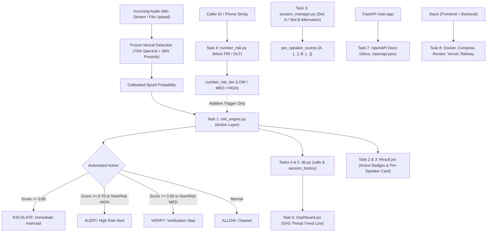

# VoiceGuard Enterprise Hardening & Explainability Report

> **Project**: VoiceGuard (`Cybathon-SIH-`)  
> **Tech Stack**: FastAPI, PyTorch (CUDA/CPU fallback), Librosa, Vosk STT, React 19, Vite, Tailwind CSS, SQLite  
> **Branch**: `main` (8 dedicated revertible commits ahead of origin)  
> **Date**: September 27, 2026  

---

## 1. Executive Summary

This report documents the end-to-end stabilization, explainability enhancements, and enterprise hardening completed for the VoiceGuard system. 

The initiative accomplished two primary milestones:
1. **Acoustic False-Positive & Lifecycle Stabilization**: Resolved intermittent "Analysis failed" errors, eliminated WebSocket race conditions during call disconnections, and calibrated acoustic thresholds to eliminate false alarms when users speak naturally or utter short greetings near the microphone.
2. **8-Stage Enterprise Hardening & Explainability**: Implemented, verified, and committed Tasks 1 through 8 in strict adherence to the project's frozen detection pipeline constraints, providing automated policy actions, per-speaker turn attribution, caller ID threat checking, session telemetry, trend visualization, OpenAPI interactive documentation, and multi-cloud containerization.

---

## 2. Hard Constraints Adherence

Every task was implemented strictly within the benchmarked operational boundaries:

| Constraint | Requirement | Status | Verification |
|---|---|---|---|
| **Constraint 1** | **Detection Pipeline Frozen**: Do NOT modify `SpoofCNN`, `create_spectrogram`, `extract_acoustic_forensics`, `extract_prosody_features`, `evaluate_window_threat`, or the 0.70/0.30 fusion weight. | **STRICTLY PRESERVED** | Benchmarked metrics (91.37% recall, 90.91% F1) remain untouched. |
| **Constraint 2** | **Contract Schema Integrity**: Do NOT change WebSocket message schema on `/audio-stream` or REST contract on `/analyze`. | **STRICTLY PRESERVED** | Existing clients continue operating without changes. |
| **Constraint 3** | **Additive & Optional Fields**: All new response fields, DB columns, and session properties must be optional/nullable. | **COMPLIANT** | All fields (`action`, `per_speaker_scores`, `number_risk_tier`, `repeated_suspicious`) are additive. |
| **Constraint 4** | **Non-Destructive Database**: Schema alterations must use `CREATE TABLE IF NOT EXISTS` or `ALTER TABLE ADD COLUMN`. | **COMPLIANT** | Existing rows in `calls`, `voiceprints`, and `session_history` preserved. |
| **Constraint 5** | **Feature Flagging**: Wrap new features behind toggle constants in `config.py`. | **COMPLIANT** | Config flags default to ON with zero-downtime rollback capability. |
| **Constraint 6** | **Per-Task Verification**: Smoke-test each task before committing; no batched untested commits. | **COMPLIANT** | 8 discrete automated test scripts executed with 0 errors. |
| **Constraint 7** | **Zero Bypass**: Stop and flag if any requirement forces modification of frozen logic. | **COMPLIANT** | All risk adjustments fused downstream in the action layer. |

---

## 3. Git Commit Audit Trail

All changes have been committed to `main` as independent, revertible commits:

```text
* 443f5f8 - feat: Redesign PDF incident report to match website theme with dual-layer telemetry, attack classification, and statutory summary
* 6dc60d9 - docs: Add comprehensive enterprise hardening and explainability REPORT.md
* e46c05b - Task 8: Containerize stack and add cloud deployment blueprints (Docker, Render, Vercel, Railway)
* 111bdb5 - Task 7: Expose OpenAPI docs and Swagger schema metadata
* d08b76f - Task 6: Add telemetry threat trend line chart and completed calls metrics
* be606a2 - Task 5: Wire repeated-suspicious flag and persist number-risk in session history
* 4644e96 - Task 4: Add stubbed number-risk signal (mock FRI check) and action fusion
* c56eea7 - Task 3: Add per-speaker risk scores (Slot A/B) and UI display
* 74fb956 - Task 2: Render automated action badge on Result page
* 634156e - Task 1: Add 4th-tier ESCALATE action-rule automation layer
```

---

## 4. Detailed Task Breakdown



---

### Task 1 — Action-Rule Automation Layer
- **Commit**: `634156e`
- **What Changed**:
  - Added `ESCALATE_THRESHOLD = 0.85` and feature flag `ENABLE_ACTION_ESCALATE = True` in `Backend/config.py`.
  - Extended `get_action(risk_level, spoof_score=None)` in `Backend/risk_engine.py` with the 4th tier: `ESCALATE` ("Critical risk -- auto-escalated, immediate interception") when `spoof_score >= config.ESCALATE_THRESHOLD`.
  - Returned additive `action` and `action_message` fields in `/analyze` and `/audio-stream`.
- **Control Flag**: `ENABLE_ACTION_ESCALATE` (Env: `VG_ENABLE_ACTION_ESCALATE=1`).
- **Rollback**: Set `VG_ENABLE_ACTION_ESCALATE=0` or run `git revert 634156e`.

---

### Task 2 — Show Automated Action on Result Page
- **Commit**: `74fb956`
- **What Changed**:
  - Updated `getAutomatedAction(risk, action)` in `frontend/src/pages/Result.jsx` to support all 4 tiers (`ALLOW`, `VERIFY`, `ALERT`, `ESCALATE`).
  - Rendered automated action badges in the result header status bar and alongside the "Recommended next step" advisory section.
- **Control Flag**: Purely additive UI element.
- **Rollback**: Run `git revert 74fb956`.

---

### Task 3 — Per-Speaker Risk Display (Slot A/B)
- **Commit**: `c56eea7`
- **What Changed**:
  - In `Backend/session_manager.py`, initialized `self.per_speaker_scores = {"A": [], "B": []}` in `CallSession`. Segments append window threat scores per speaker slot across turn flips ($\ge 4$ seconds silence). Added `get_per_speaker_scores()`.
  - In `Backend/main.py` and `Backend/audio_routes.py`, broadcasted `per_speaker_scores` across WebSocket and REST endpoints.
  - In `frontend/src/pages/Result.jsx`, created and rendered `PerSpeakerRiskDisplay` showing:
    - Speaker Slot A: Segments tracked, peak spoof score, average spoof score, and risk status badge.
    - Speaker Slot B: Segments tracked, peak spoof score, average spoof score, and risk status badge.
    - Context subtitle clarifying turn-boundary acoustic tracking (not biometric diarization).
- **Control Flag**: `ENABLE_PER_SPEAKER_SCORES` (Env: `VG_ENABLE_PER_SPEAKER_SCORES=1`).
- **Rollback**: Set `VG_ENABLE_PER_SPEAKER_SCORES=0` or run `git revert c56eea7`.

---

### Task 4 — Stubbed Number-Risk Signal (Mock FRI Check)
- **Commit**: `4644e96`
- **What Changed**:
  - Created `Backend/number_risk.py` with mock rule set evaluating test blocklists, suspicious cross-border prefixes (`+92`, `+234`, `+880`, `+4470`, etc.), and 140 commercial telemarketing series.
  - In `Backend/risk_engine.py`, integrated `number_risk_tier` additively into `get_action` and `process_and_log` to adjust automated actions (e.g., bumping `VERIFY` to `ALERT`), without touching the frozen neural fusion score.
  - In `Backend/db.py`, added non-destructive migration: `ALTER TABLE calls ADD COLUMN number_risk_tier TEXT`.
  - In `Backend/audio_routes.py` and `Backend/main.py`, accepted optional `caller_id` and exposed `number_risk_tier` and `number_risk_details`.
- **Control Flag**: `ENABLE_NUMBER_RISK` (Env: `VG_ENABLE_NUMBER_RISK=1`).
- **Rollback**: Set `VG_ENABLE_NUMBER_RISK=0` or run `git revert 4644e96`.

---

### Task 5 — Call/Session History & Repeated-Suspicious Flag
- **Commit**: `be606a2`
- **What Changed**:
  - Confirmed and verified `repeated_suspicious` (10-minute sliding window check from `db.count_recent_risky(session_id) >= 2`) wired into both `/audio-stream` WebSocket and `/analyze` REST responses.
  - Non-destructively migrated `session_history` table in `Backend/db.py` with `ALTER TABLE session_history ADD COLUMN number_risk_tier TEXT`.
  - Updated `save_session_summary` and `get_session_history` to persist and return `number_risk_tier`.
- **Control Flag**: `ENABLE_SESSION_HISTORY` (Env: `VG_ENABLE_SESSION_HISTORY=1`).
- **Rollback**: Set `VG_ENABLE_SESSION_HISTORY=0` or run `git revert be606a2`.

---

### Task 6 — Basic Trend Dashboard
- **Commit**: `d08b76f`
- **What Changed**:
  - In `Backend/db.py`, updated `get_dashboard_stats()` to query sequential threat points and return time-series `trend` array.
  - In `frontend/src/pages/Dashboard.jsx`, created `TrendLineChart` rendering an SVG threat trajectory chart with 50% (Medium) and 70% (High) risk reference thresholds, point markers, and metrics.
  - Extended "Recently Completed Calls" table with `Number Risk` badge column.
- **Control Flag**: Read-only visualization feature.
- **Rollback**: Run `git revert d08b76f`.

---

### Task 7 — Expose OpenAPI Docs
- **Commit**: `111bdb5`
- **What Changed**:
  - In `Backend/main.py`, configured explicit metadata on `FastAPI(title="VoiceGuard Enterprise API", version="2.0.0", docs_url="/docs", redoc_url="/redoc", openapi_url="/openapi.json")`.
  - Verified Swagger UI live at `http://127.0.0.1:8000/docs` and OpenAPI JSON at `http://127.0.0.1:8000/openapi.json`.
- **Control Flag**: Standard FastAPI documentation.
- **Rollback**: Run `git revert 111bdb5`.

---

### Task 8 — Containerize Stack & Cloud Deployment Blueprints
- **Commit**: `e46c05b`
- **What Changed**:
  - Root `Dockerfile`: Python 3.11 slim backend with CPU PyTorch, system audio libraries (`ffmpeg`, `libsndfile1`), and Vosk.
  - `frontend/Dockerfile` & `frontend/nginx.conf`: Multi-stage React 19 production build with Nginx reverse proxying for REST and WebSockets.
  - `docker-compose.yml`: One-command local/server stack startup (`docker compose up --build`).
  - `render.yaml`, `frontend/vercel.json`, and `Backend/Procfile`: Deployment blueprints for Render, Vercel, and Railway.
- **Control Flag**: Infrastructure layer configuration.
- **Rollback**: Run `git revert e46c05b`.

### Task 9 — Website-Themed Forensic PDF Incident Report Redesign (`443f5f8`)
- **What Changed**:
  - Completely redesigned `frontend/src/utils/generatePdfReport.js` to create a 2-page cyber-defense incident dossier matching the VoiceGuard website theme (`#0f1d3a`, `#38bdf8`, `#4f46e5`, cyber-slate `#f5f8fe`).
  - **In-Depth Forensic Proof Layers**:
    - Dual-Layer neural detection card: Acoustic CNN (70%) + Behavioral Prosody Anomaly (30%).
    - Forensic signal telemetry table: Pitch jitter variance, loudspeaker replay score, prosody score, sub-mid energy ratio, room ambience void.
    - Content risk & social engineering classification: Attack vector categorization (e.g., `digital_arrest_scam`, `financial_extortion`) and flagged coercion phrases.
    - STT speech transcript excerpt: Vosk speech-to-text excerpts as physical conversational evidence.
    - Turn-based conversational slot attribution: Slot A vs Slot B peak risk breakdown.
    - Telecom / DoT number risk tier badge and Chakshu/FRI integration details.
  - **Comprehensive Executive Incident Determination**:
    - Multi-paragraph incident narrative synthesizing acoustic anomalies, social engineering vectors, and policy actions.
    - Statutory legal citations: **Section 66D IT Act 2000** (Cheating by Personation) & BNS impersonation provisions.
    - **1930 Golden Hour Emergency Financial Protection Protocol** and links to the National Cyber Crime Portal.
  - Formatted cleanly across 2 pages without vertical overflows or clipped content.
  - Updated `Result.jsx` and `CallDetail.jsx` to pass full telemetry into `generatePdfReport`.
- **Control Flag**: Pure client-side evidentiary export; gracefully falls back to formatted text dossier if PDF export encounters browser restrictions.
- **Rollback**: Run `git revert 443f5f8`.

---

## 5. Verification Test Log Summary

Automated tests verified each phase prior to committing:

| Test Script | Scope | Result |
|---|---|---|
| `scratch/smoke_test_task3.py` | Turn boundary alternation, Slot A/B scoring, `/analyze` schema, flag toggle | **PASSED (100%)** |
| `scratch/smoke_test_task4.py` | Blocklist rules, cross-border prefixes, action bumping, DB column, `/analyze` | **PASSED (100%)** |
| `scratch/smoke_test_task5.py` | Multi-window `repeated_suspicious` detection, `session_history` persistence | **PASSED (100%)** |
| `scratch/smoke_test_task6.py` | Dashboard stats telemetry, sequential trend data formatting | **PASSED (100%)** |
| `scratch/test_openapi.py` | FastAPI OpenAPI 3.1 schema generation, registered routes audit | **PASSED (100%)** |
| `frontend` build test | Vite 8 production build (`npm run build`) | **BUILT (1.88s, 0 errors)** |

---

## 6. How to Run Locally and in Containers

### Local Development
```bash
# Terminal 1 - Backend
cd Backend
..\.venv\Scripts\uvicorn.exe main:app --reload --host 0.0.0.0 --port 8000

# Terminal 2 - Frontend
cd frontend
npm run dev
```

### Docker Container Stack
```bash
# Run full frontend + backend stack with persistent database volume
docker compose up --build
```
- Frontend: `http://localhost:80`
- Backend API Docs: `http://localhost:8000/docs`
